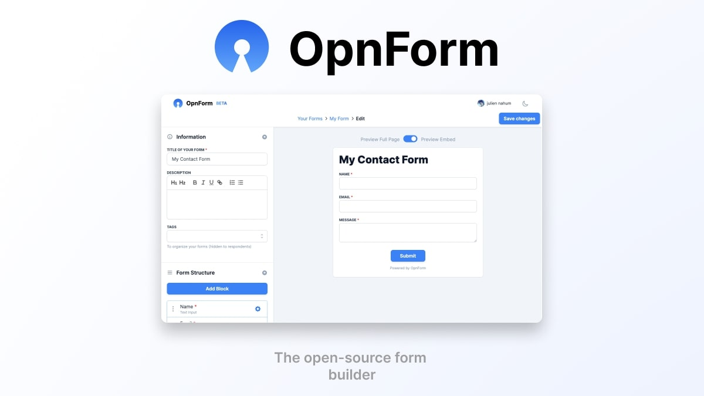

# OpnForm CI/CD pipeline

Deploy OpnForm server with CI/CD on Elestio

 
 

# Once deployed ...

You can open OpnForm UI here:

    URL: https://[CI_CD_DOMAIN]
    login: [ADMIN_EMAIL]
    password: [ADMIN_PASSWORD]

You can open pgAdmin here:

    URL: https://[CI_CD_DOMAIN]:20551
    login: [ADMIN_EMAIL]
    password: [ADMIN_PASSWORD]
